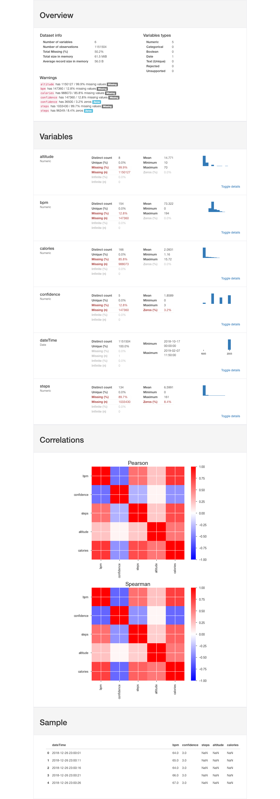

# Fitbit_JSON_export_converter

Code to clean up and convert the messy .json files from Fitbits Export Tool into Pandas DataFrame and .csv format 
See the accompanying [blog post for a detailed description of the script](http://dataespresso.com/en/2019/02/07/fitbit-json-to-csv/)

## File Structure

### Data
The downloaded data from Fitbit goes into this folder.

### Notebooks
Currently, this folder includes a notebook version of the file, the only thing that differentiates this from the .py script is data exploration. 

## Collaborators needed
Collaborators are very welcome to enhance and extend the code.

### Further work

1. Adding more JSON files to the script
This current code only covers a few of the measurements exported, and it just a matter of code-lines to integrate more readings into the cleaning script. 

2. Improve the loading speed
Currently it takes quite a bit of time to load all the JSON files, and since we have the timestamp in each file, the load process can be moved away from a slow loop into a quicker parallel function. 

3. Smart joins
Currently the dataframes are naively joined on the timestamp column, but a better approach would be to join for example steps and altitude to the nearest DateTime in another column to avoid adding unnecessary length to the file and to avoid creating more missing values. 

4. Filling in missing values
Currently no missing values are being filled in, but this can easily be done with some smart individual column based functions. For example heart rate can be filled in with a rolling median filter while missing values in steps means that there is no movement and the missing values should be replaced with 0. 

5. Data Analysis
The ultimate goal of this project is to be able to download the data, have python automatically clean it and generate helpful reports.
This can be simple exploratory data analysis, or some more clever machine learning on the parameters - with so much data collected, the only limit is our imagination!

## Output
The current output is a .csv file of all the merged .json files

The Notebook also produces a visual and interactive analysis of the data.
Example:

